# 🏗️ Diagrammes et Figures - Backend ERP MIF Maroc

Ce document contient l'ensemble des diagrammes et figures techniques générées pour le backend ERP de maintenance industrielle MIF Maroc.

## 📋 Table des Matières

1. [Architecture Système](#1-architecture-système)
2. [Modèle de Données (ERD)](#2-modèle-de-données-erd)
3. [Architecture API](#3-architecture-api)
4. [Diagrammes de Séquence](#4-diagrammes-de-séquence)
5. [Diagrammes d'État](#5-diagrammes-détat)
6. [Architecture des Services](#6-architecture-des-services)
7. [Flux d'Authentification](#7-flux-dauthentification)
8. [Déploiement et Infrastructure](#8-déploiement-et-infrastructure)
9. [Flux de Données](#9-flux-de-données)
10. [Monitoring et Observabilité](#10-monitoring-et-observabilité)

---

## 1. Architecture Système

### 1.1 Vue d'ensemble du Système

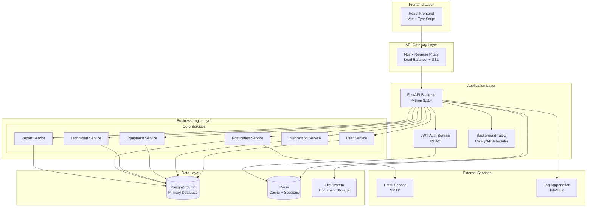
```mermaid
graph TB
    subgraph "Frontend Layer"
        FE[React Frontend<br/>Vite + TypeScript]
    end
    
    subgraph "API Gateway Layer"
        NGINX[Nginx Reverse Proxy<br/>Load Balancer + SSL]
    end
    
    subgraph "Application Layer"
        API[FastAPI Backend<br/>Python 3.11+]
        AUTH[JWT Auth Service<br/>RBAC]
        BG[Background Tasks<br/>Celery/APScheduler]
    end
    
    subgraph "Business Logic Layer"
        subgraph "Core Services"
            US[User Service]
            IS[Intervention Service] 
            ES[Equipment Service]
            TS[Technician Service]
            NS[Notification Service]
            RS[Report Service]
        end
    end
    
    subgraph "Data Layer"
        DB[(PostgreSQL 16<br/>Primary Database)]
        REDIS[(Redis<br/>Cache + Sessions)]
        FS[File System<br/>Document Storage]
    end
    
    subgraph "External Services"
        EMAIL[Email Service<br/>SMTP]
        LOGS[Log Aggregation<br/>File/ELK]
    end
    
    FE --> NGINX
    NGINX --> API
    API --> AUTH
    API --> BG
    API --> US
    API --> IS
    API --> ES
    API --> TS
    API --> NS
    API --> RS
    
    US --> DB
    IS --> DB
    ES --> DB
    TS --> DB
    NS --> DB
    RS --> DB
    
    API --> REDIS
    AUTH --> REDIS
    API --> FS
    NS --> EMAIL
    API --> LOGS
```

### 1.2 Architecture en Couches

```mermaid
graph LR
    subgraph "Presentation Layer"
        REST[REST API Endpoints<br/>OpenAPI 3.0]
        DOC[Interactive Documentation<br/>Swagger UI + ReDoc]
    end
    
    subgraph "Business Layer"
        SERV[Service Layer<br/>Business Logic]
        VALID[Validation Layer<br/>Pydantic Schemas]
        RBAC[Authorization Layer<br/>Role-Based Access]
    end
    
    subgraph "Data Access Layer"
        ORM[SQLAlchemy ORM<br/>2.0 Async]
        REPO[Repository Pattern<br/>Data Access Objects]
        CACHE[Caching Layer<br/>Redis Integration]
    end
    
    subgraph "Infrastructure Layer"
        DB[(Database<br/>PostgreSQL)]
        FILES[File Storage<br/>Local/Cloud)]
        QUEUE[Message Queue<br/>Background Tasks)]
    end
    
    REST --> SERV
    DOC --> REST
    SERV --> VALID
    SERV --> RBAC
    SERV --> ORM
    SERV --> REPO
    REPO --> CACHE
    ORM --> DB
    REPO --> FILES
    SERV --> QUEUE
```

---

## 2. Modèle de Données (ERD)

### 2.1 Diagramme Entité-Relation Principal

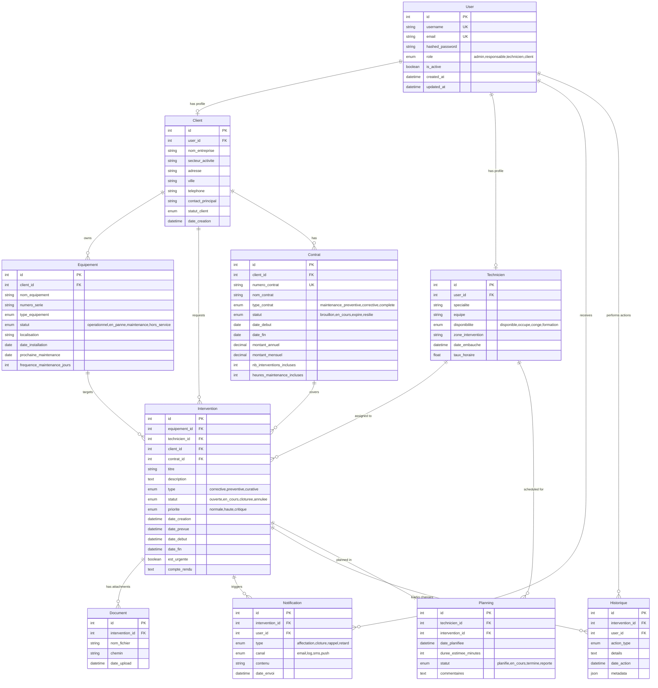
```mermaid
erDiagram
    User {
        int id PK
        string username UK
        string email UK
        string hashed_password
        enum role "admin,responsable,technicien,client"
        boolean is_active
        datetime created_at
        datetime updated_at
    }
    
    Client {
        int id PK
        int user_id FK
        string nom_entreprise
        string secteur_activite
        string adresse
        string ville
        string telephone
        string contact_principal
        enum statut_client
        datetime date_creation
    }
    
    Technicien {
        int id PK
        int user_id FK
        string specialite
        string equipe
        enum disponibilite "disponible,occupe,conge,formation"
        string zone_intervention
        datetime date_embauche
        float taux_horaire
    }
    
    Equipement {
        int id PK
        int client_id FK
        string nom_equipement
        string numero_serie
        enum type_equipement
        enum statut "operationnel,en_panne,maintenance,hors_service"
        string localisation
        date date_installation
        date prochaine_maintenance
        int frequence_maintenance_jours
    }
    
    Intervention {
        int id PK
        int equipement_id FK
        int technicien_id FK
        int client_id FK
        int contrat_id FK
        string titre
        text description
        enum type "corrective,preventive,curative"
        enum statut "ouverte,en_cours,cloturee,annulee"
        enum priorite "normale,haute,critique"
        datetime date_creation
        datetime date_prevue
        datetime date_debut
        datetime date_fin
        boolean est_urgente
        text compte_rendu
    }
    
    Contrat {
        int id PK
        int client_id FK
        string numero_contrat UK
        string nom_contrat
        enum type_contrat "maintenance_preventive,corrective,complete"
        enum statut "brouillon,en_cours,expire,resilie"
        date date_debut
        date date_fin
        decimal montant_annuel
        decimal montant_mensuel
        int nb_interventions_incluses
        int heures_maintenance_incluses
    }
    
    Document {
        int id PK
        int intervention_id FK
        string nom_fichier
        string chemin
        datetime date_upload
    }
    
    Notification {
        int id PK
        int intervention_id FK
        int user_id FK
        enum type "affectation,cloture,rappel,retard"
        enum canal "email,log,sms,push"
        string contenu
        datetime date_envoi
    }
    
    Planning {
        int id PK
        int technicien_id FK
        int intervention_id FK
        datetime date_planifiee
        int duree_estimee_minutes
        enum statut "planifie,en_cours,termine,reporte"
        text commentaires
    }
    
    Historique {
        int id PK
        int intervention_id FK
        int user_id FK
        enum action_type
        text details
        datetime date_action
        json metadata
    }
    
    %% Relations principales
    User ||--o| Client : "has profile"
    User ||--o| Technicien : "has profile"
    Client ||--o{ Equipement : "owns"
    Client ||--o{ Intervention : "requests"
    Client ||--o{ Contrat : "has"
    Equipement ||--o{ Intervention : "targets"
    Technicien ||--o{ Intervention : "assigned to"
    Contrat ||--o{ Intervention : "covers"
    Intervention ||--o{ Document : "has attachments"
    Intervention ||--o{ Notification : "triggers"
    Intervention ||--o{ Historique : "tracks changes"
    Technicien ||--o{ Planning : "scheduled for"
    Intervention ||--o| Planning : "planned in"
    User ||--o{ Notification : "receives"
    User ||--o{ Historique : "performs actions"
```

### 2.2 Relations et Cardinalités Détaillées

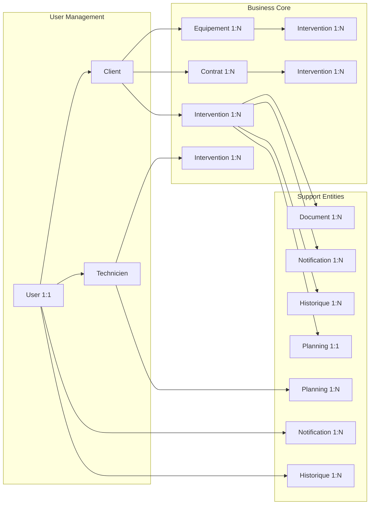
```mermaid
graph LR
    subgraph "User Management"
        U[User 1:1] --> C[Client]
        U --> T[Technicien]
    end
    
    subgraph "Business Core"
        C --> E[Equipement 1:N]
        C --> CT[Contrat 1:N]
        C --> I[Intervention 1:N]
        T --> I2[Intervention 1:N]
        E --> I3[Intervention 1:N]
        CT --> I4[Intervention 1:N]
    end
    
    subgraph "Support Entities"
        I --> D[Document 1:N]
        I --> N[Notification 1:N]
        I --> H[Historique 1:N]
        I --> P[Planning 1:1]
        T --> P2[Planning 1:N]
        U --> N2[Notification 1:N]
        U --> H2[Historique 1:N]
    end
```

---

## 3. Architecture API

### 3.1 Structure des Endpoints REST

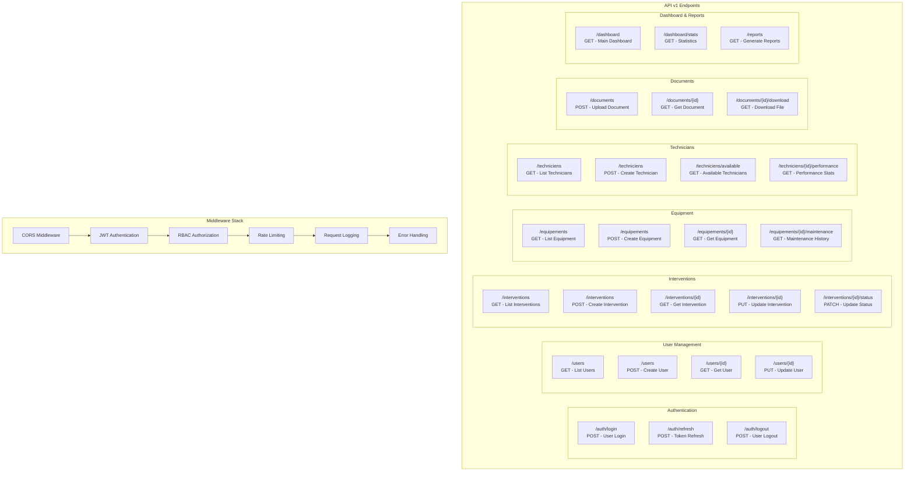
```mermaid
graph TB
    subgraph "API v1 Endpoints"
        subgraph "Authentication"
            AUTH_LOGIN["/auth/login<br/>POST - User Login"]
            AUTH_REFRESH["/auth/refresh<br/>POST - Token Refresh"]
            AUTH_LOGOUT["/auth/logout<br/>POST - User Logout"]
        end
        
        subgraph "User Management"
            USERS_LIST["/users<br/>GET - List Users"]
            USERS_CREATE["/users<br/>POST - Create User"]
            USERS_GET["/users/{id}<br/>GET - Get User"]
            USERS_UPDATE["/users/{id}<br/>PUT - Update User"]
        end
        
        subgraph "Interventions"
            INT_LIST["/interventions<br/>GET - List Interventions"]
            INT_CREATE["/interventions<br/>POST - Create Intervention"]
            INT_GET["/interventions/{id}<br/>GET - Get Intervention"]
            INT_UPDATE["/interventions/{id}<br/>PUT - Update Intervention"]
            INT_STATUS["/interventions/{id}/status<br/>PATCH - Update Status"]
        end
        
        subgraph "Equipment"
            EQ_LIST["/equipements<br/>GET - List Equipment"]
            EQ_CREATE["/equipements<br/>POST - Create Equipment"]
            EQ_GET["/equipements/{id}<br/>GET - Get Equipment"]
            EQ_MAINT["/equipements/{id}/maintenance<br/>GET - Maintenance History"]
        end
        
        subgraph "Technicians"
            TECH_LIST["/techniciens<br/>GET - List Technicians"]
            TECH_CREATE["/techniciens<br/>POST - Create Technician"]
            TECH_AVAIL["/techniciens/available<br/>GET - Available Technicians"]
            TECH_PERF["/techniciens/{id}/performance<br/>GET - Performance Stats"]
        end
        
        subgraph "Documents"
            DOC_UPLOAD["/documents<br/>POST - Upload Document"]
            DOC_GET["/documents/{id}<br/>GET - Get Document"]
            DOC_DOWNLOAD["/documents/{id}/download<br/>GET - Download File"]
        end
        
        subgraph "Dashboard & Reports"
            DASH_MAIN["/dashboard<br/>GET - Main Dashboard"]
            DASH_STATS["/dashboard/stats<br/>GET - Statistics"]
            REPORTS["/reports<br/>GET - Generate Reports"]
        end
    end
    
    subgraph "Middleware Stack"
        CORS[CORS Middleware]
        AUTH_MW[JWT Authentication]
        RBAC_MW[RBAC Authorization]
        RATE_LIMIT[Rate Limiting]
        LOGGING[Request Logging]
        ERROR[Error Handling]
    end
    
    CORS --> AUTH_MW
    AUTH_MW --> RBAC_MW
    RBAC_MW --> RATE_LIMIT
    RATE_LIMIT --> LOGGING
    LOGGING --> ERROR
```

### 3.2 Modèle de Réponse API Standard

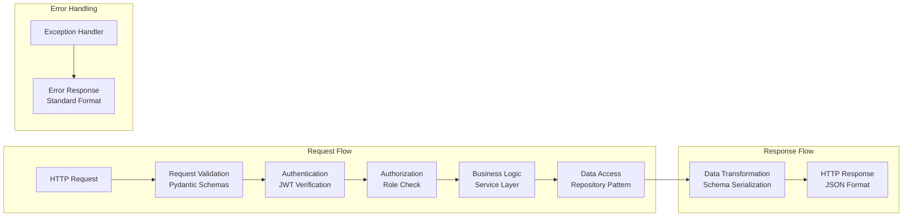
```mermaid
graph LR
    subgraph "Request Flow"
        REQ[HTTP Request] --> VAL[Request Validation<br/>Pydantic Schemas]
        VAL --> AUTH[Authentication<br/>JWT Verification]
        AUTH --> RBAC[Authorization<br/>Role Check]
        RBAC --> BL[Business Logic<br/>Service Layer]
        BL --> DATA[Data Access<br/>Repository Pattern]
    end
    
    subgraph "Response Flow"
        DATA --> TRANSFORM[Data Transformation<br/>Schema Serialization]
        TRANSFORM --> RESP[HTTP Response<br/>JSON Format]
    end
    
    subgraph "Error Handling"
        ERROR[Exception Handler] --> ERR_RESP[Error Response<br/>Standard Format]
    end
```

---

## 4. Diagrammes de Séquence

### 4.1 Authentification Utilisateur

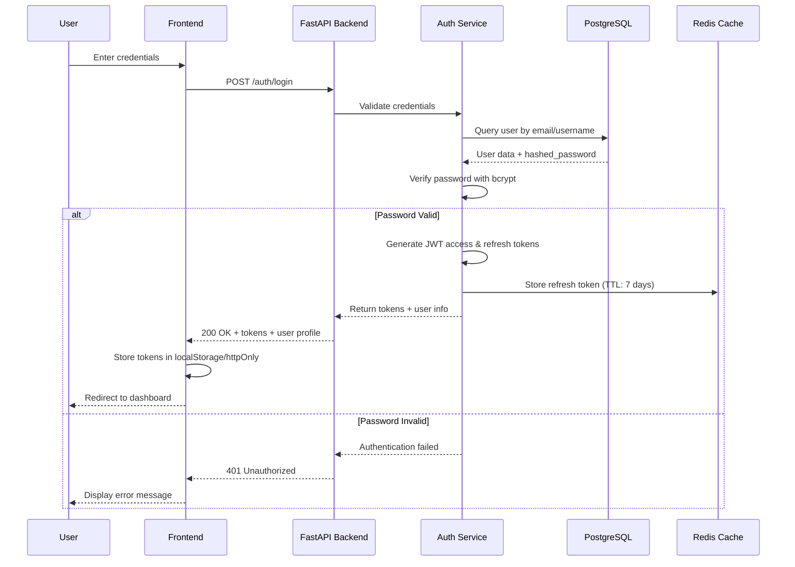
```mermaid
sequenceDiagram
    participant U as User
    participant FE as Frontend
    participant API as FastAPI Backend
    participant AUTH as Auth Service
    participant DB as PostgreSQL
    participant REDIS as Redis Cache

    U->>FE: Enter credentials
    FE->>API: POST /auth/login
    API->>AUTH: Validate credentials
    AUTH->>DB: Query user by email/username
    DB-->>AUTH: User data + hashed_password
    AUTH->>AUTH: Verify password with bcrypt
    
    alt Password Valid
        AUTH->>AUTH: Generate JWT access & refresh tokens
        AUTH->>REDIS: Store refresh token (TTL: 7 days)
        AUTH-->>API: Return tokens + user info
        API-->>FE: 200 OK + tokens + user profile
        FE->>FE: Store tokens in localStorage/httpOnly
        FE-->>U: Redirect to dashboard
    else Password Invalid
        AUTH-->>API: Authentication failed
        API-->>FE: 401 Unauthorized
        FE-->>U: Display error message
    end
```

### 4.2 Création d'Intervention Complète

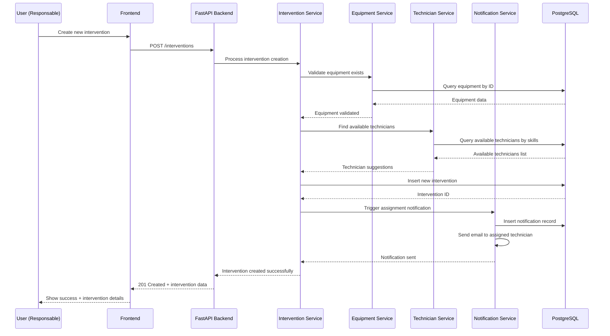
```mermaid
sequenceDiagram
    participant U as User (Responsable)
    participant FE as Frontend
    participant API as FastAPI Backend
    participant IS as Intervention Service
    participant ES as Equipment Service
    participant TS as Technician Service
    participant NS as Notification Service
    participant DB as PostgreSQL

    U->>FE: Create new intervention
    FE->>API: POST /interventions
    API->>IS: Process intervention creation
    
    IS->>ES: Validate equipment exists
    ES->>DB: Query equipment by ID
    DB-->>ES: Equipment data
    ES-->>IS: Equipment validated
    
    IS->>TS: Find available technicians
    TS->>DB: Query available technicians by skills
    DB-->>TS: Available technicians list
    TS-->>IS: Technician suggestions
    
    IS->>DB: Insert new intervention
    DB-->>IS: Intervention ID
    
    IS->>NS: Trigger assignment notification
    NS->>DB: Insert notification record
    NS->>NS: Send email to assigned technician
    NS-->>IS: Notification sent
    
    IS-->>API: Intervention created successfully
    API-->>FE: 201 Created + intervention data
    FE-->>U: Show success + intervention details
```

### 4.3 Upload et Gestion de Documents

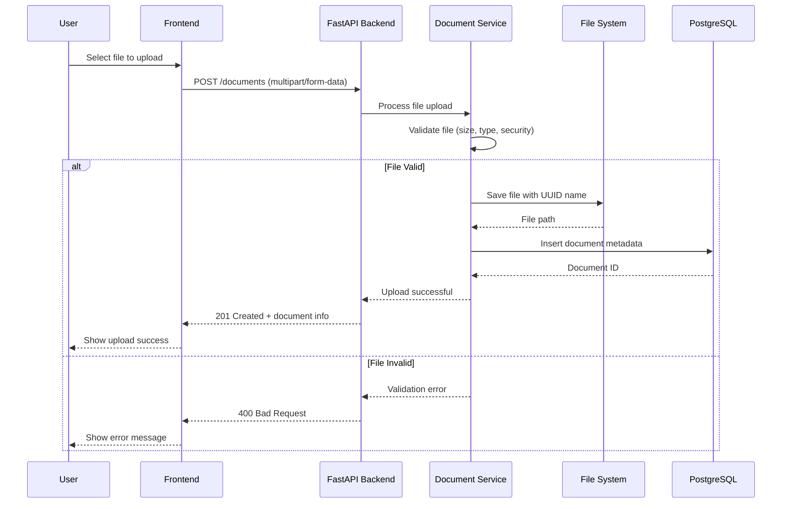
```mermaid
sequenceDiagram
    participant U as User
    participant FE as Frontend
    participant API as FastAPI Backend
    participant DS as Document Service
    participant FS as File System
    participant DB as PostgreSQL

    U->>FE: Select file to upload
    FE->>API: POST /documents (multipart/form-data)
    API->>DS: Process file upload
    
    DS->>DS: Validate file (size, type, security)
    
    alt File Valid
        DS->>FS: Save file with UUID name
        FS-->>DS: File path
        DS->>DB: Insert document metadata
        DB-->>DS: Document ID
        DS-->>API: Upload successful
        API-->>FE: 201 Created + document info
        FE-->>U: Show upload success
    else File Invalid
        DS-->>API: Validation error
        API-->>FE: 400 Bad Request
        FE-->>U: Show error message
    end
```

### 4.4 Workflow de Planification Automatique

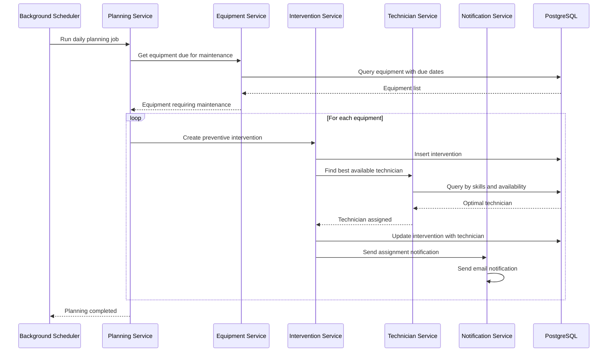
```mermaid
sequenceDiagram
    participant SCHEDULER as Background Scheduler
    participant PS as Planning Service
    participant ES as Equipment Service
    participant IS as Intervention Service
    participant TS as Technician Service
    participant NS as Notification Service
    participant DB as PostgreSQL

    SCHEDULER->>PS: Run daily planning job
    PS->>ES: Get equipment due for maintenance
    ES->>DB: Query equipment with due dates
    DB-->>ES: Equipment list
    ES-->>PS: Equipment requiring maintenance
    
    loop For each equipment
        PS->>IS: Create preventive intervention
        IS->>DB: Insert intervention
        IS->>TS: Find best available technician
        TS->>DB: Query by skills and availability
        DB-->>TS: Optimal technician
        TS-->>IS: Technician assigned
        IS->>DB: Update intervention with technician
        IS->>NS: Send assignment notification
        NS->>NS: Send email notification
    end
    
    PS-->>SCHEDULER: Planning completed
```

---

## 5. Diagrammes d'État

### 5.1 Machine d'État des Interventions

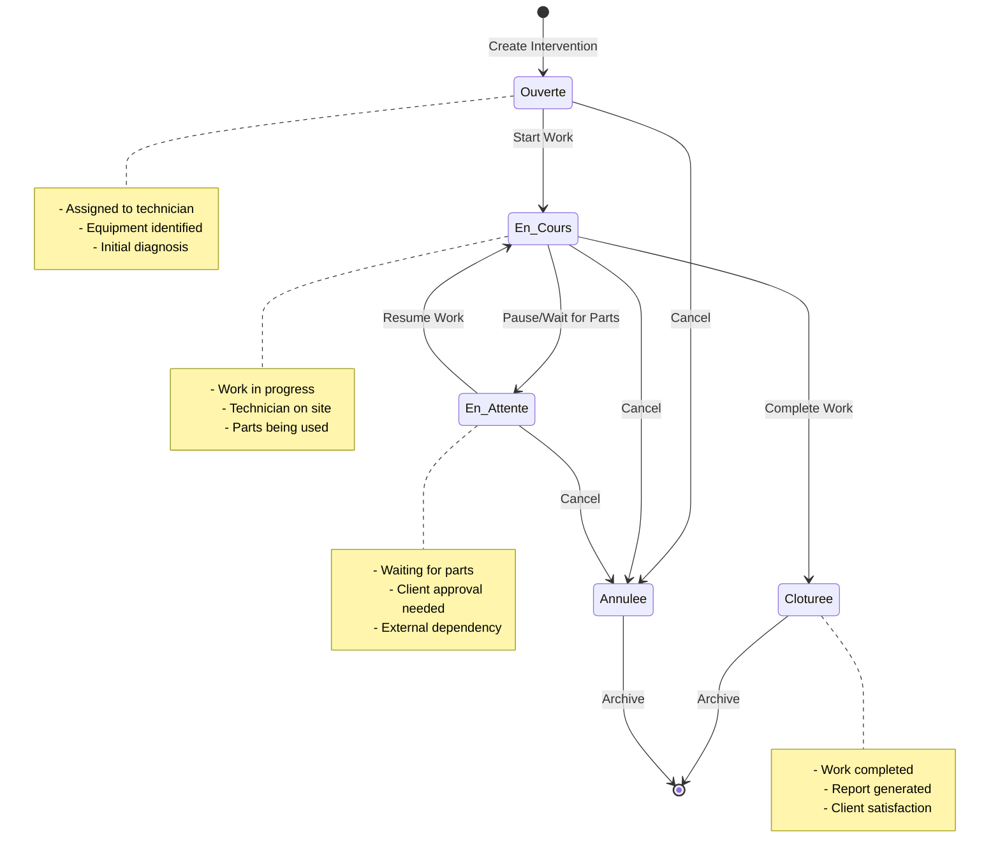
```mermaid
stateDiagram-v2
    [*] --> Ouverte : Create Intervention
    
    Ouverte --> En_Cours : Start Work
    Ouverte --> Annulee : Cancel
    
    En_Cours --> En_Attente : Pause/Wait for Parts
    En_Cours --> Cloturee : Complete Work
    En_Cours --> Annulee : Cancel
    
    En_Attente --> En_Cours : Resume Work
    En_Attente --> Annulee : Cancel
    
    Cloturee --> [*] : Archive
    Annulee --> [*] : Archive
    
    note right of Ouverte
        - Assigned to technician
        - Equipment identified
        - Initial diagnosis
    end note
    
    note right of En_Cours
        - Work in progress
        - Technician on site
        - Parts being used
    end note
    
    note right of En_Attente
        - Waiting for parts
        - Client approval needed
        - External dependency
    end note
    
    note right of Cloturee
        - Work completed
        - Report generated
        - Client satisfaction
    end note
```

### 5.2 États des Équipements

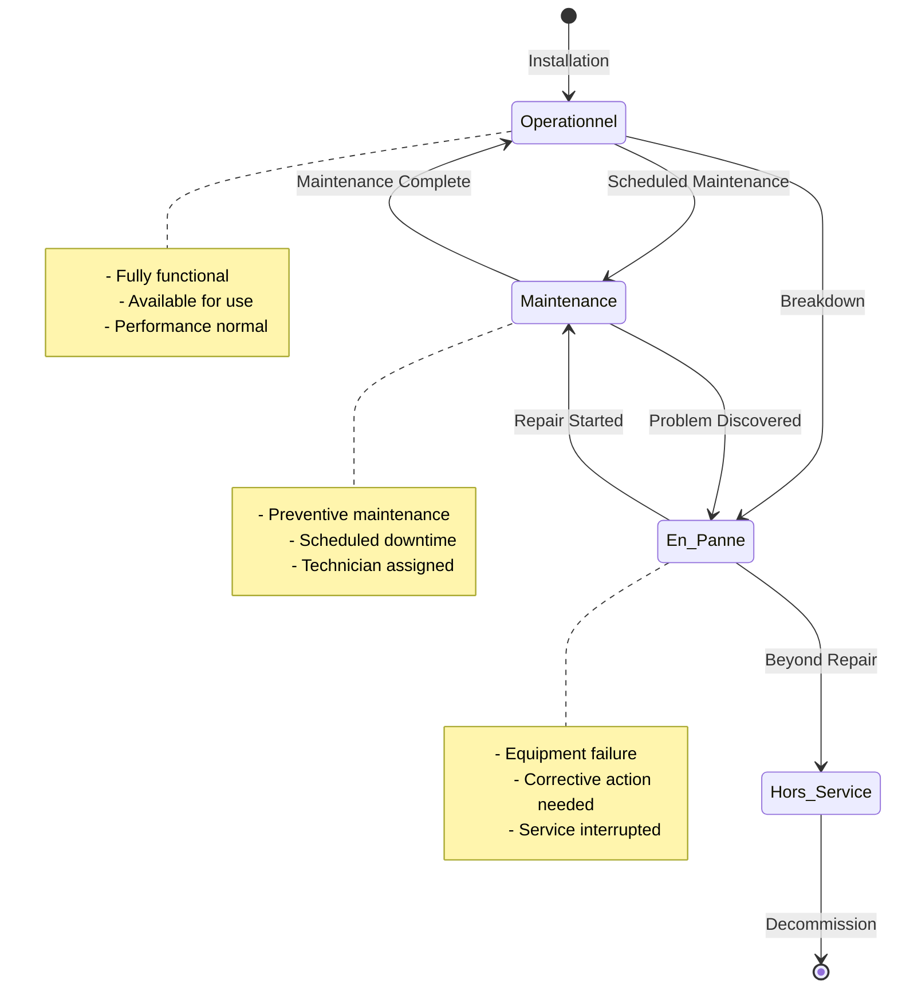
```mermaid
stateDiagram-v2
    [*] --> Operationnel : Installation
    
    Operationnel --> Maintenance : Scheduled Maintenance
    Operationnel --> En_Panne : Breakdown
    
    Maintenance --> Operationnel : Maintenance Complete
    Maintenance --> En_Panne : Problem Discovered
    
    En_Panne --> Maintenance : Repair Started
    En_Panne --> Hors_Service : Beyond Repair
    
    Hors_Service --> [*] : Decommission
    
    note right of Operationnel
        - Fully functional
        - Available for use
        - Performance normal
    end note
    
    note right of Maintenance
        - Preventive maintenance
        - Scheduled downtime
        - Technician assigned
    end note
    
    note right of En_Panne
        - Equipment failure
        - Corrective action needed
        - Service interrupted
    end note
```

### 5.3 Disponibilité des Techniciens

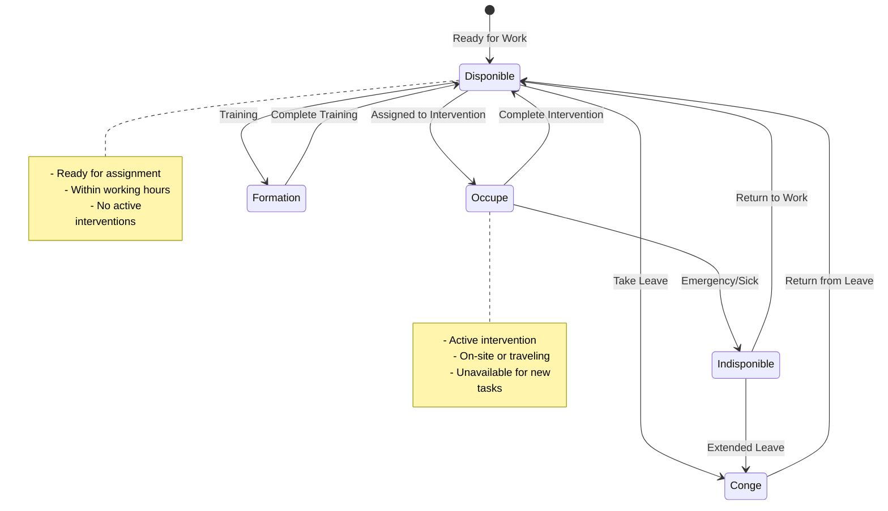
```mermaid
stateDiagram-v2
    [*] --> Disponible : Ready for Work
    
    Disponible --> Occupe : Assigned to Intervention
    Disponible --> Conge : Take Leave
    Disponible --> Formation : Training
    
    Occupe --> Disponible : Complete Intervention
    Occupe --> Indisponible : Emergency/Sick
    
    Conge --> Disponible : Return from Leave
    Formation --> Disponible : Complete Training
    
    Indisponible --> Disponible : Return to Work
    Indisponible --> Conge : Extended Leave
    
    note right of Disponible
        - Ready for assignment
        - Within working hours
        - No active interventions
    end note
    
    note right of Occupe
        - Active intervention
        - On-site or traveling
        - Unavailable for new tasks
    end note
```

---

## 6. Architecture des Services

### 6.1 Couche Service et Dépendances

```mermaid
graph TB
    subgraph "API Controllers"
        AC[Auth Controller]
        UC[User Controller]
        IC[Intervention Controller]
        EC[Equipment Controller]
        TC[Technician Controller]
        DC[Document Controller]
        RC[Report Controller]
    end
    
    subgraph "Service Layer"
        AS[Auth Service]
        US[User Service]
        IS[Intervention Service]
        ES[Equipment Service]
        TS[Technician Service]
        DS[Document Service]
        NS[Notification Service]
        PS[Planning Service]
        RS[Report Service]
    end
    
    subgraph "Repository Layer"
        UR[User Repository]
        IR[Intervention Repository]
        ER[Equipment Repository]
        TR[Technician Repository]
        DR[Document Repository]
        NR[Notification Repository]
    end
    
    subgraph "External Services"
        EMAIL[Email Service]
        FILE[File Storage]
        CACHE[Redis Cache]
    end
    
    AC --> AS
    UC --> US
    IC --> IS
    EC --> ES
    TC --> TS
    DC --> DS
    RC --> RS
    
    AS --> UR
    US --> UR
    IS --> IR
    IS --> ES
    IS --> TS
    ES --> ER
    TS --> TR
    DS --> DR
    
    IS --> NS
    PS --> IS
    PS --> ES
    PS --> TS
    NS --> NR
    RS --> IR
    RS --> ER
    
    NS --> EMAIL
    DS --> FILE
    AS --> CACHE
    US --> CACHE
```

### 6.2 Patterns d'Architecture Appliqués

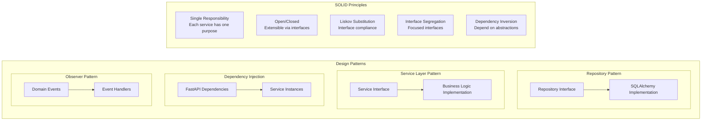
```mermaid
graph LR
    subgraph "Design Patterns"
        subgraph "Repository Pattern"
            REPO[Repository Interface] --> IMPL[SQLAlchemy Implementation]
        end
        
        subgraph "Service Layer Pattern"
            SERV[Service Interface] --> LOGIC[Business Logic Implementation]
        end
        
        subgraph "Dependency Injection"
            DI[FastAPI Dependencies] --> SERVICE[Service Instances]
        end
        
        subgraph "Observer Pattern"
            EVENT[Domain Events] --> HANDLER[Event Handlers]
        end
    end
    
    subgraph "SOLID Principles"
        SRP[Single Responsibility<br/>Each service has one purpose]
        OCP[Open/Closed<br/>Extensible via interfaces]
        LSP[Liskov Substitution<br/>Interface compliance]
        ISP[Interface Segregation<br/>Focused interfaces]
        DIP[Dependency Inversion<br/>Depend on abstractions]
    end
```

---

## 7. Flux d'Authentification

### 7.1 JWT Authentication Flow

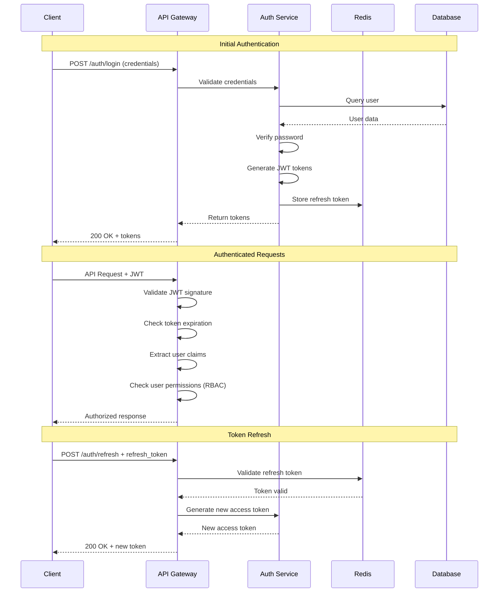
```mermaid
sequenceDiagram
    participant C as Client
    participant API as API Gateway
    participant AUTH as Auth Service
    participant REDIS as Redis
    participant DB as Database

    Note over C,DB: Initial Authentication
    C->>API: POST /auth/login (credentials)
    API->>AUTH: Validate credentials
    AUTH->>DB: Query user
    DB-->>AUTH: User data
    AUTH->>AUTH: Verify password
    AUTH->>AUTH: Generate JWT tokens
    AUTH->>REDIS: Store refresh token
    AUTH-->>API: Return tokens
    API-->>C: 200 OK + tokens
    
    Note over C,DB: Authenticated Requests
    C->>API: API Request + JWT
    API->>API: Validate JWT signature
    API->>API: Check token expiration
    API->>API: Extract user claims
    API->>API: Check user permissions (RBAC)
    API-->>C: Authorized response
    
    Note over C,DB: Token Refresh
    C->>API: POST /auth/refresh + refresh_token
    API->>REDIS: Validate refresh token
    REDIS-->>API: Token valid
    API->>AUTH: Generate new access token
    AUTH-->>API: New access token
    API-->>C: 200 OK + new token
```

### 7.2 Role-Based Access Control (RBAC)

```mermaid
graph TB
    subgraph "Roles Hierarchy"
        ADMIN[Admin<br/>Full System Access]
        RESP[Responsable<br/>Management Level]
        TECH[Technicien<br/>Operational Level]
        CLIENT[Client<br/>Limited Access]
    end
    
    subgraph "Permissions Matrix"
        subgraph "User Management"
            UP1[Create Users] --> ADMIN
            UP2[Modify Users] --> ADMIN
            UP3[View Users] --> ADMIN
            UP3 --> RESP
        end
        
        subgraph "Interventions"
            IP1[Create Interventions] --> ADMIN
            IP1 --> RESP
            IP2[Assign Technicians] --> ADMIN
            IP2 --> RESP
            IP3[Update Status] --> ADMIN
            IP3 --> RESP
            IP3 --> TECH
            IP4[View Own Interventions] --> TECH
            IP4 --> CLIENT
        end
        
        subgraph "Equipment"
            EP1[Manage Equipment] --> ADMIN
            EP1 --> RESP
            EP2[View Equipment] --> TECH
            EP3[View Own Equipment] --> CLIENT
        end
        
        subgraph "Reports"
            RP1[All Reports] --> ADMIN
            RP2[Team Reports] --> RESP
            RP3[Personal Reports] --> TECH
        end
    end
```

### 7.3 Security Middleware Stack

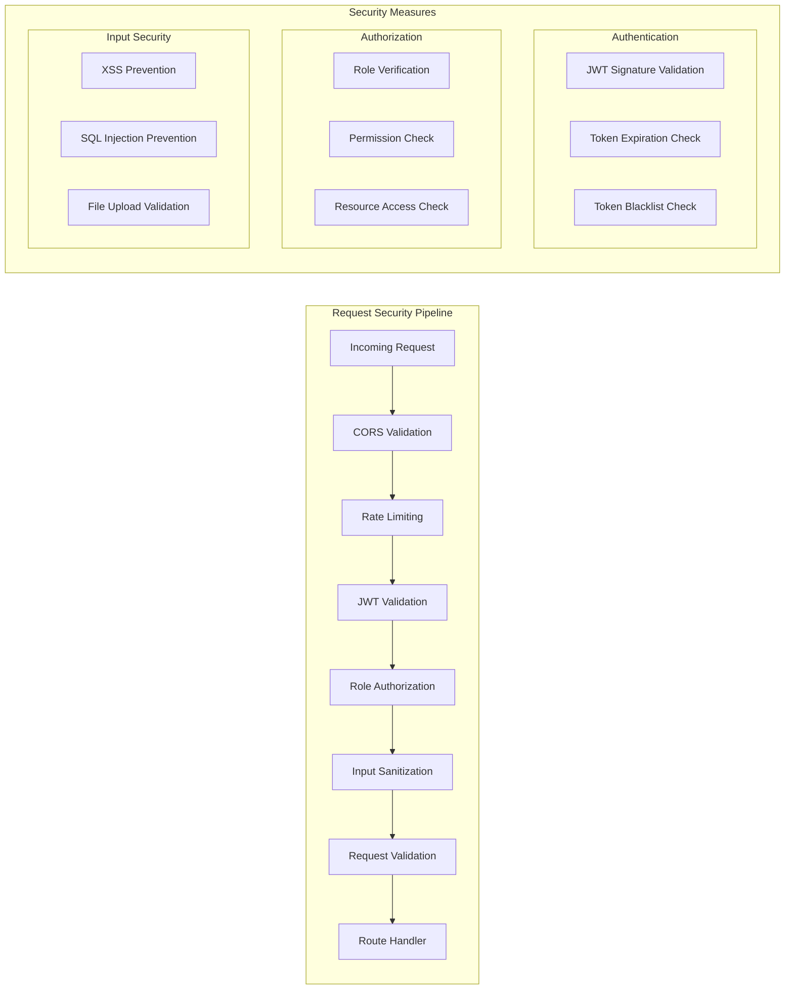
```mermaid
graph LR
    subgraph "Request Security Pipeline"
        REQ[Incoming Request] --> CORS[CORS Validation]
        CORS --> RATE[Rate Limiting]
        RATE --> JWT[JWT Validation]
        JWT --> RBAC[Role Authorization]
        RBAC --> INPUT[Input Sanitization]
        INPUT --> VALID[Request Validation]
        VALID --> HANDLER[Route Handler]
    end
    
    subgraph "Security Measures"
        subgraph "Authentication"
            JWT_SIG[JWT Signature Validation]
            JWT_EXP[Token Expiration Check]
            JWT_BLACKLIST[Token Blacklist Check]
        end
        
        subgraph "Authorization"
            ROLE_CHECK[Role Verification]
            PERM_CHECK[Permission Check]
            RESOURCE_CHECK[Resource Access Check]
        end
        
        subgraph "Input Security"
            XSS[XSS Prevention]
            INJECTION[SQL Injection Prevention]
            FILE_VALID[File Upload Validation]
        end
    end
```

---

## 8. Déploiement et Infrastructure

### 8.1 Architecture de Déploiement Production

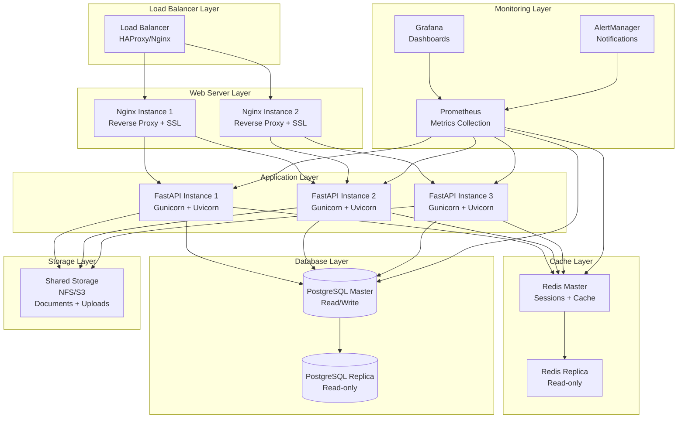
```mermaid
graph TB
    subgraph "Load Balancer Layer"
        LB[Load Balancer<br/>HAProxy/Nginx]
    end
    
    subgraph "Web Server Layer"
        WEB1[Nginx Instance 1<br/>Reverse Proxy + SSL]
        WEB2[Nginx Instance 2<br/>Reverse Proxy + SSL]
    end
    
    subgraph "Application Layer"
        APP1[FastAPI Instance 1<br/>Gunicorn + Uvicorn]
        APP2[FastAPI Instance 2<br/>Gunicorn + Uvicorn]
        APP3[FastAPI Instance 3<br/>Gunicorn + Uvicorn]
    end
    
    subgraph "Cache Layer"
        REDIS1[Redis Master<br/>Sessions + Cache]
        REDIS2[Redis Replica<br/>Read-only]
    end
    
    subgraph "Database Layer"
        DB_MASTER[(PostgreSQL Master<br/>Read/Write)]
        DB_REPLICA[(PostgreSQL Replica<br/>Read-only)]
    end
    
    subgraph "Storage Layer"
        NFS[Shared Storage<br/>NFS/S3<br/>Documents + Uploads]
    end
    
    subgraph "Monitoring Layer"
        PROM[Prometheus<br/>Metrics Collection]
        GRAFANA[Grafana<br/>Dashboards]
        ALERT[AlertManager<br/>Notifications]
    end
    
    LB --> WEB1
    LB --> WEB2
    WEB1 --> APP1
    WEB1 --> APP2
    WEB2 --> APP2
    WEB2 --> APP3
    
    APP1 --> REDIS1
    APP2 --> REDIS1
    APP3 --> REDIS1
    REDIS1 --> REDIS2
    
    APP1 --> DB_MASTER
    APP2 --> DB_MASTER
    APP3 --> DB_MASTER
    DB_MASTER --> DB_REPLICA
    
    APP1 --> NFS
    APP2 --> NFS
    APP3 --> NFS
    
    PROM --> APP1
    PROM --> APP2
    PROM --> APP3
    PROM --> DB_MASTER
    PROM --> REDIS1
    GRAFANA --> PROM
    ALERT --> PROM
```

### 8.2 Container Architecture (Docker)

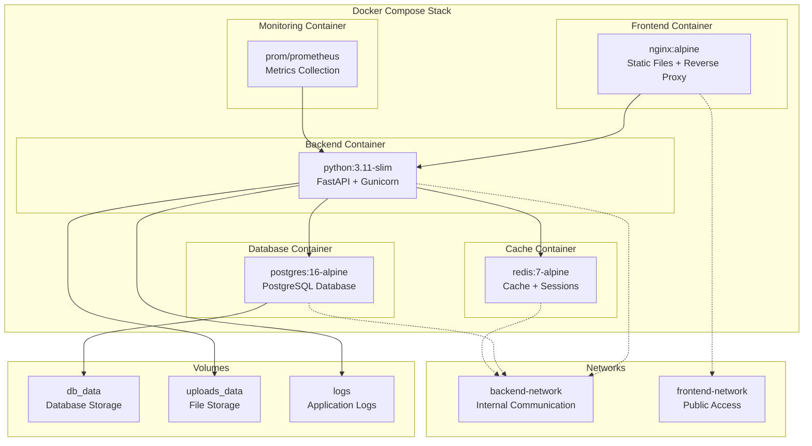
```mermaid
graph TB
    subgraph "Docker Compose Stack"
        subgraph "Frontend Container"
            FE_CONT[nginx:alpine<br/>Static Files + Reverse Proxy]
        end
        
        subgraph "Backend Container"
            API_CONT[python:3.11-slim<br/>FastAPI + Gunicorn]
        end
        
        subgraph "Database Container"
            DB_CONT[postgres:16-alpine<br/>PostgreSQL Database]
        end
        
        subgraph "Cache Container"
            REDIS_CONT[redis:7-alpine<br/>Cache + Sessions]
        end
        
        subgraph "Monitoring Container"
            PROM_CONT[prom/prometheus<br/>Metrics Collection]
        end
    end
    
    subgraph "Volumes"
        DB_VOL[db_data<br/>Database Storage]
        UPLOAD_VOL[uploads_data<br/>File Storage]
        LOGS_VOL[logs<br/>Application Logs]
    end
    
    subgraph "Networks"
        BACKEND_NET[backend-network<br/>Internal Communication]
        FRONTEND_NET[frontend-network<br/>Public Access]
    end
    
    FE_CONT --> API_CONT
    API_CONT --> DB_CONT
    API_CONT --> REDIS_CONT
    PROM_CONT --> API_CONT
    
    DB_CONT --> DB_VOL
    API_CONT --> UPLOAD_VOL
    API_CONT --> LOGS_VOL
    
    FE_CONT -.-> FRONTEND_NET
    API_CONT -.-> BACKEND_NET
    DB_CONT -.-> BACKEND_NET
    REDIS_CONT -.-> BACKEND_NET
```

### 8.3 CI/CD Pipeline

```mermaid
graph LR
    subgraph "Source Control"
        GIT[Git Repository<br/>GitHub/GitLab]
    end
    
    subgraph "CI Pipeline"
        TRIGGER[Push/PR Trigger] --> BUILD[Build & Test]
        BUILD --> LINT[Code Quality<br/>Ruff + Black]
        LINT --> TEST[Unit Tests<br/>pytest]
        TEST --> SECURITY[Security Scan<br/>Bandit + Safety]
        SECURITY --> COVERAGE[Coverage Report<br/>pytest-cov]
    end
    
    subgraph "CD Pipeline"
        COVERAGE --> DOCKER[Build Docker Image]
        DOCKER --> REGISTRY[Push to Registry<br/>Docker Hub/ECR]
        REGISTRY --> DEPLOY_STAGE[Deploy to Staging]
        DEPLOY_STAGE --> E2E[E2E Tests<br/>Integration Tests]
        E2E --> DEPLOY_PROD[Deploy to Production]
    end
    
    subgraph "Monitoring"
        DEPLOY_PROD --> HEALTH[Health Checks]
        HEALTH --> METRICS[Performance Metrics]
        METRICS --> ALERTS[Alert Rules]
    end
    
    GIT --> TRIGGER
```

---

## 9. Flux de Données

### 9.1 Data Flow Architecture

```mermaid
graph TB
    subgraph "Data Input Sources"
        USER_INPUT[User Input<br/>Forms + API]
        FILE_UPLOAD[File Uploads<br/>Documents + Images]
        SCHEDULED[Scheduled Tasks<br/>Background Jobs]
        EXTERNAL[External APIs<br/>Third-party Services]
    end
    
    subgraph "Data Processing Layer"
        VALIDATION[Input Validation<br/>Pydantic Schemas]
        TRANSFORMATION[Data Transformation<br/>Business Logic]
        ENRICHMENT[Data Enrichment<br/>Computed Fields]
    end
    
    subgraph "Data Storage Layer"
        PRIMARY_DB[(PostgreSQL<br/>Primary Data)]
        CACHE[(Redis Cache<br/>Temporary Data)]
        FILE_STORAGE[File System<br/>Documents + Media]
    end
    
    subgraph "Data Output Channels"
        API_RESPONSE[API Responses<br/>JSON Format]
        NOTIFICATIONS[Notifications<br/>Email + Push]
        REPORTS[Reports<br/>PDF + Excel]
        WEBHOOKS[Webhooks<br/>External Systems]
    end
    
    USER_INPUT --> VALIDATION
    FILE_UPLOAD --> VALIDATION
    SCHEDULED --> TRANSFORMATION
    EXTERNAL --> VALIDATION
    
    VALIDATION --> TRANSFORMATION
    TRANSFORMATION --> ENRICHMENT
    
    ENRICHMENT --> PRIMARY_DB
    ENRICHMENT --> CACHE
    ENRICHMENT --> FILE_STORAGE
    
    PRIMARY_DB --> API_RESPONSE
    PRIMARY_DB --> REPORTS
    CACHE --> API_RESPONSE
    FILE_STORAGE --> API_RESPONSE
    
    TRANSFORMATION --> NOTIFICATIONS
    ENRICHMENT --> WEBHOOKS
```

### 9.2 Data Synchronization Patterns

```mermaid
sequenceDiagram
    participant CLIENT as Client Request
    participant API as API Layer
    participant CACHE as Redis Cache
    participant DB as PostgreSQL
    participant BG as Background Jobs

    Note over CLIENT,BG: Read Pattern (Cache-Aside)
    CLIENT->>API: GET /interventions
    API->>CACHE: Check cache
    
    alt Cache Hit
        CACHE-->>API: Return cached data
    else Cache Miss
        API->>DB: Query database
        DB-->>API: Return data
        API->>CACHE: Store in cache
    end
    
    API-->>CLIENT: Return response
    
    Note over CLIENT,BG: Write Pattern (Write-Through)
    CLIENT->>API: POST /interventions
    API->>DB: Insert data
    DB-->>API: Confirm insert
    API->>CACHE: Update cache
    API->>BG: Trigger notifications
    BG->>BG: Send notifications
    API-->>CLIENT: Return success
    
    Note over CLIENT,BG: Background Sync
    BG->>CACHE: Refresh cached data
    BG->>DB: Bulk operations
    BG->>API: Update real-time clients
```

---

## 10. Monitoring et Observabilité

### 10.1 Architecture de Monitoring

```mermaid
graph TB
    subgraph "Application Layer"
        APP1[FastAPI Instance 1<br/>/metrics endpoint]
        APP2[FastAPI Instance 2<br/>/metrics endpoint]
        APP3[FastAPI Instance 3<br/>/metrics endpoint]
    end
    
    subgraph "Infrastructure Layer"
        DB[(PostgreSQL<br/>pg_stat_* metrics)]
        REDIS[(Redis<br/>INFO metrics)]
        NGINX[Nginx<br/>Access logs + metrics]
    end
    
    subgraph "Metrics Collection"
        PROM[Prometheus<br/>Metrics Scraping]
        NODE_EXP[Node Exporter<br/>System Metrics]
        PG_EXP[PostgreSQL Exporter<br/>DB Metrics]
    end
    
    subgraph "Log Aggregation"
        FILEBEAT[Filebeat<br/>Log Shipping]
        LOGSTASH[Logstash<br/>Log Processing]
        ELASTIC[Elasticsearch<br/>Log Storage]
        KIBANA[Kibana<br/>Log Visualization]
    end
    
    subgraph "Visualization & Alerting"
        GRAFANA[Grafana<br/>Dashboards]
        ALERT_MGR[AlertManager<br/>Alert Routing]
        SLACK[Slack<br/>Notifications]
        EMAIL[Email<br/>Notifications]
    end
    
    APP1 --> PROM
    APP2 --> PROM
    APP3 --> PROM
    DB --> PG_EXP
    PG_EXP --> PROM
    REDIS --> PROM
    NODE_EXP --> PROM
    
    APP1 --> FILEBEAT
    APP2 --> FILEBEAT
    APP3 --> FILEBEAT
    NGINX --> FILEBEAT
    FILEBEAT --> LOGSTASH
    LOGSTASH --> ELASTIC
    ELASTIC --> KIBANA
    
    PROM --> GRAFANA
    PROM --> ALERT_MGR
    ALERT_MGR --> SLACK
    ALERT_MGR --> EMAIL
```

### 10.2 Key Performance Indicators (KPIs)

```mermaid
graph LR
    subgraph "Application Metrics"
        subgraph "Response Times"
            RT1[API Response Time<br/>P50, P95, P99]
            RT2[Database Query Time<br/>Average + Max]
        end
        
        subgraph "Throughput"
            TH1[Requests per Second<br/>Total + By Endpoint]
            TH2[Interventions Created<br/>Per Hour/Day]
        end
        
        subgraph "Error Rates"
            ER1[HTTP Error Rate<br/>4xx + 5xx]
            ER2[Database Errors<br/>Connection + Query]
        end
    end
    
    subgraph "Business Metrics"
        subgraph "Operational KPIs"
            BM1[Active Interventions<br/>Count + Status Distribution]
            BM2[Technician Utilization<br/>Percentage + Availability]
            BM3[Equipment Uptime<br/>Availability + MTBF]
        end
        
        subgraph "Performance KPIs"
            BM4[Resolution Time<br/>Average + SLA Compliance]
            BM5[Customer Satisfaction<br/>Rating + Feedback]
            BM6[First Time Fix Rate<br/>Percentage]
        end
    end
    
    subgraph "Infrastructure Metrics"
        subgraph "System Resources"
            IM1[CPU Usage<br/>Percentage + Load]
            IM2[Memory Usage<br/>RAM + Swap]
            IM3[Disk I/O<br/>Read/Write + Space]
        end
        
        subgraph "Network & DB"
            IM4[Network Traffic<br/>In/Out + Errors]
            IM5[DB Connections<br/>Active + Pool Usage]
            IM6[Cache Hit Rate<br/>Redis Performance]
        end
    end
```

### 10.3 Alerting Rules and Thresholds

```mermaid
graph TB
    subgraph "Critical Alerts (Immediate)"
        CRIT1[API Down<br/>Response Time > 10s]
        CRIT2[Database Unavailable<br/>Connection Failed]
        CRIT3[High Error Rate<br/>> 5% in 5min]
        CRIT4[Memory Usage<br/>> 90%]
    end
    
    subgraph "Warning Alerts (5min delay)"
        WARN1[High Response Time<br/>> 2s average]
        WARN2[High CPU Usage<br/>> 80%]
        WARN3[Low Disk Space<br/>< 20% free]
        WARN4[Cache Miss Rate<br/>> 30%]
    end
    
    subgraph "Info Alerts (15min delay)"
        INFO1[New User Registration<br/>Spike detected]
        INFO2[Bulk Operations<br/>Running longer than usual]
        INFO3[Scheduled Task<br/>Execution status]
    end
    
    subgraph "Notification Channels"
        PAGER[PagerDuty<br/>Critical Only]
        SLACK_CRIT[Slack #alerts<br/>Critical + Warning]
        EMAIL_TEAM[Email Team<br/>All Alerts]
        DASHBOARD[Grafana<br/>Visual Indicators]
    end
    
    CRIT1 --> PAGER
    CRIT2 --> PAGER
    CRIT3 --> PAGER
    CRIT4 --> PAGER
    
    CRIT1 --> SLACK_CRIT
    CRIT2 --> SLACK_CRIT
    CRIT3 --> SLACK_CRIT
    WARN1 --> SLACK_CRIT
    WARN2 --> SLACK_CRIT
    
    CRIT1 --> EMAIL_TEAM
    WARN1 --> EMAIL_TEAM
    INFO1 --> EMAIL_TEAM
    
    CRIT1 --> DASHBOARD
    WARN1 --> DASHBOARD
    INFO1 --> DASHBOARD
```

---

## 📊 Résumé des Diagrammes

Ce document comprend **32 diagrammes** couvrant tous les aspects du backend ERP :

### Types de Diagrammes Inclus :
- **4 Diagrammes d'Architecture Système** - Vue d'ensemble et couches
- **2 Diagrammes de Modèle de Données** - ERD complet et relations
- **2 Diagrammes d'Architecture API** - Structure REST et réponses
- **4 Diagrammes de Séquence** - Flux métier principaux
- **3 Diagrammes d'État** - Machines d'état des entités
- **2 Diagrammes d'Architecture Services** - Couches et patterns
- **3 Diagrammes d'Authentification** - JWT, RBAC et sécurité
- **3 Diagrammes de Déploiement** - Production, containers et CI/CD
- **2 Diagrammes de Flux de Données** - Architecture et synchronisation
- **7 Diagrammes de Monitoring** - Observabilité complète

### Technologies Représentées :
- **Backend** : FastAPI, Python 3.11+, SQLAlchemy 2.0
- **Base de Données** : PostgreSQL 16, Redis
- **Déploiement** : Docker, Nginx, Gunicorn
- **Monitoring** : Prometheus, Grafana, ELK Stack
- **Sécurité** : JWT, RBAC, Input Validation

Tous les diagrammes utilisent la syntaxe **Mermaid** et sont compatibles avec GitHub, GitLab et la plupart des plateformes de documentation modernes.

---

*Généré pour le projet ERP MIF Maroc Backend - Version 1.0*
