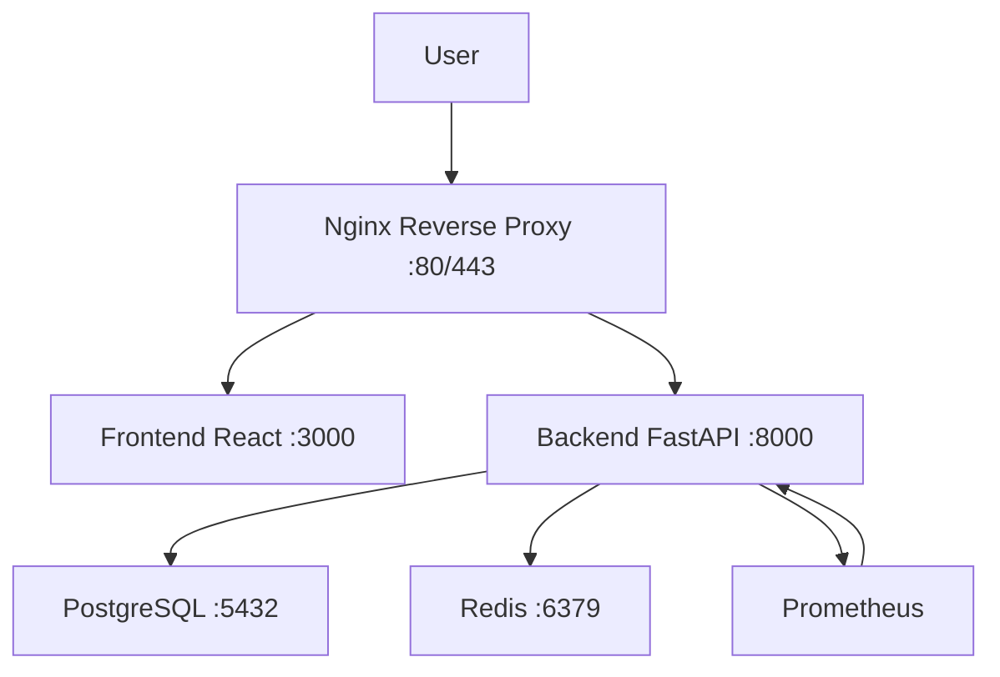

# Deployment Diagram

## Services Inventory
Based on docker-compose.yml and docker-compose.prod.yml:

- Frontend: React + Vite (separate repo/folder VITE-FRONTEND-ERP-MIF-MAROC/, served by Vite dev server or Nginx in prod)
- Backend: FastAPI (port 8000)
- Database: PostgreSQL (port 5432)
- Cache: Redis (port 6379, in prod)
- Reverse Proxy: Nginx (in prod, port 80/443)
- Monitoring: Prometheus (in monitoring/)

## Ports & Flows
- FE → BE: HTTP/HTTPS to 8000
- BE → DB: Internal to 5432
- BE → Redis: Internal to 6379
- Nginx → FE static files
- Nginx → BE API proxy
- Prometheus → BE /metrics

## Diagram (Mermaid)

## Criteria
- ✅ 100% of flows in scope covered (FE, BE, DB, Redis, Nginx, Prom)
