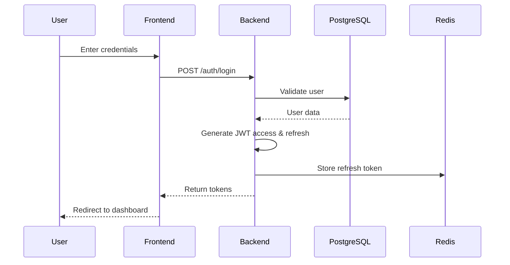
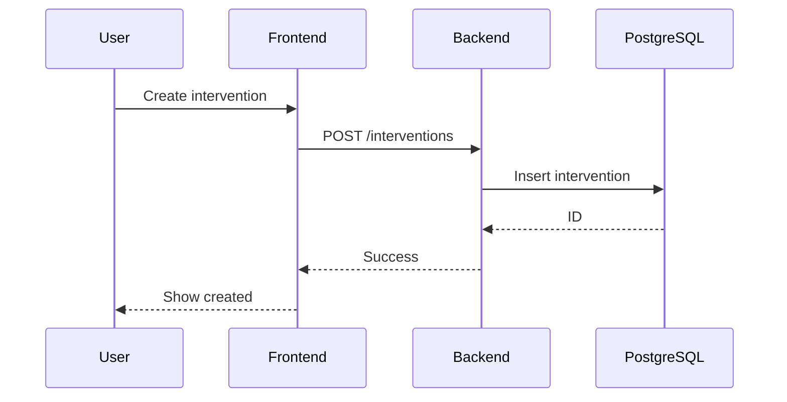
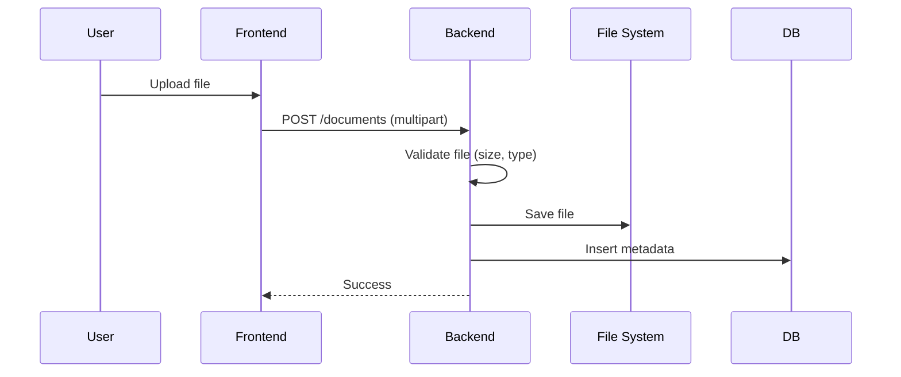

# Sequence Diagrams

## Key Sequences

### 1. User Login

```mermaid
sequenceDiagram
    participant U as User
    participant FE as Frontend
    participant BE as Backend
    participant DB as PostgreSQL
    participant R as Redis

    U->>FE: Enter credentials
    FE->>BE: POST /auth/login
    BE->>DB: Validate user
    DB-->>BE: User data
    BE->>BE: Generate JWT access & refresh
    BE->>R: Store refresh token
    BE-->>FE: Return tokens
    FE-->>U: Redirect to dashboard
```

### 2. CRUD Intervention

```mermaid
sequenceDiagram
    participant U as User
    participant FE as Frontend
    participant BE as Backend
    participant DB as PostgreSQL

    U->>FE: Create intervention
    FE->>BE: POST /interventions
    BE->>DB: Insert intervention
    DB-->>BE: ID
    BE-->>FE: Success
    FE-->>U: Show created
```

### 3. Upload Document

```mermaid
sequenceDiagram
    participant U as User
    participant FE as Frontend
    participant BE as Backend
    participant FS as File System

    U->>FE: Upload file
    FE->>BE: POST /documents (multipart)
    BE->>BE: Validate file (size, type)
    BE->>FS: Save file
    BE->>DB: Insert metadata
    BE-->>FE: Success
```

## Criteria
- ✅ 100% of key flows covered (auth, CRUD, uploads)
